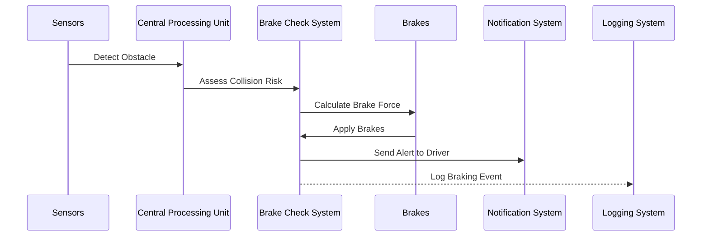
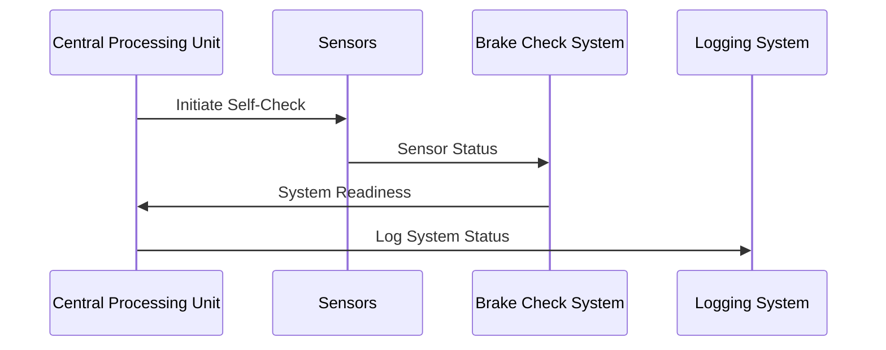
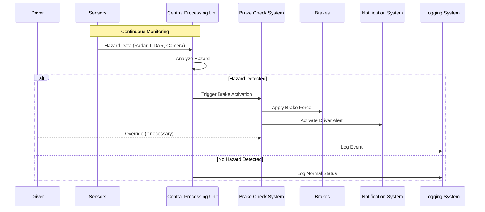
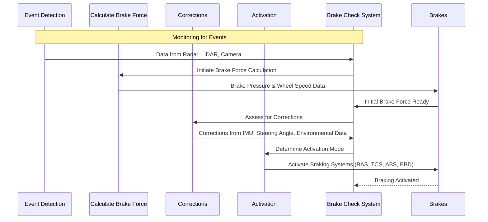

## 1. Emergency Braking Scenario

```mermaid
sequenceDiagram
    participant S as Sensors
    participant CPU as Central Processing Unit
    participant BCS as Brake Check System
    participant Brakes
    participant Notif as Notification System
    participant Log as Logging System

    S->>CPU: Detect Obstacle
    CPU->>BCS: Assess Collision Risk
    BCS->>Brakes: Calculate Brake Force
    Brakes->>BCS: Apply Brakes
    BCS->>Notif: Send Alert to Driver
    BCS-->>Log: Log Braking Event
```

## 2. System Self-Check on Start-Up

```mermaid
sequenceDiagram
    participant CPU as Central Processing Unit
    participant S as Sensors
    participant BCS as Brake Check System
    participant Log as Logging System

    CPU->>S: Initiate Self-Check
    S->>BCS: Sensor Status
    BCS->>CPU: System Readiness
    CPU->>Log: Log System Status
```

## 3 Emergency Braking with Driver Override Capability

```mermaid
sequenceDiagram
    participant D as Driver
    participant S as Sensors
    participant CPU as Central Processing Unit
    participant BCS as Brake Check System
    participant Brakes
    participant Notif as Notification System
    participant Log as Logging System

    Note over S,CPU: Continuous Monitoring
    S->>CPU: Hazard Data (Radar, LiDAR, Camera)
    CPU->>CPU: Analyze Hazard
    alt Hazard Detected
        CPU->>BCS: Trigger Brake Activation
        BCS->>Brakes: Apply Brake Force
        BCS->>Notif: Activate Driver Alert
        D-->>BCS: Override (if necessary)
        BCS->>Log: Log Event
    else No Hazard Detected
        CPU->>Log: Log Normal Status
    end
```

## 4  Integrated Brake Activation Sequence.

```mermaid
sequenceDiagram
    participant ED as Event Detection
    participant CBF as Calculate Brake Force
    participant Cor as Corrections
    participant Act as Activation
    participant BCS as Brake Check System
    participant Brakes

    Note over ED,BCS: Monitoring for Events
    ED->>BCS: Data from Radar, LiDAR, Camera
    BCS->>CBF: Initiate Brake Force Calculation
    CBF->>Brakes: Brake Pressure & Wheel Speed Data
    Brakes->>BCS: Initial Brake Force Ready
    BCS->>Cor: Assess for Corrections
    Cor->>BCS: Corrections from IMU, Steering Angle, Environmental Data
    BCS->>Act: Determine Activation Mode
    Act->>Brakes: Activate Braking Systems (BAS, TCS, ABS, EBD)
    Brakes-->>BCS: Braking Activated
```
